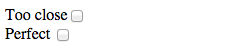
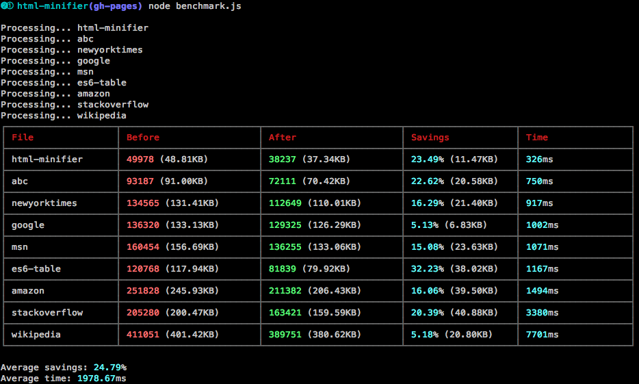

# HTML minifier revisted

4 years ago I [wrote about](http://perfectionkills.com/experimenting-with-html-minifier/) and released [HTMLMinifier](http://kangax.github.io/html-minifier/). Back then, there were [almost no tools](http://perfectionkills.com/optimizing-html/#tools) for proper HTML minification; unless you considered things like ["Absolute HTML Compressor"](http://www.alentum.com/ahc/) for Windows 95/98/XP/2000 or [Java-based HTMLCompressor](https://code.google.com/p/htmlcompressor/).

I haven't been working on it all that much, but occasionally would add a feature, fix a bug, add some tests, refactor, or pull someone's generous contribution.

Fast forward to these days, and HTMLMinifier is no longer a simple experimental piece of Javascript. With over [400 tests](http://kangax.github.io/html-minifier/tests/), running on Node.js and [packaged on NPM](https://www.npmjs.org/package/html-minifier) (with 120+ dependents), having CLI, [grunt](https://github.com/gruntjs/grunt-contrib-htmlmin)/[gulp](https://github.com/jonschlinkert/gulp-htmlmin) modules, benchmarking suite, and a number of improvements over the years, it became a rather viable tool for someone looking to squeeze the most out of front-end performance.

Seeing how minifier gained quite few new additions over the years, I thought I'd give a quick rundown of what changed and what it's now capable of.

### Better HTML5 conformance

We still rely on [John Resig's HTML parser](http://ejohn.org/blog/pure-javascript-html-parser/) but it is now heavily tweaked to conform to HTML5 and to provide more flexible parsing.

A common problem was inability to "properly" recognize block elements within inline ones.

<!-- <pre><code>
&lt;a href="...">
  &lt;div>test&lt;/div>
&lt;/a>
</code></pre> -->



This was not allowed in HTML4 but is now OK in HTML5.

Another issue was with custom elements (e.g. `<my-component>test</my-component>`). While, technically, not part of HTML5, browsers do tolerate such cases and so does minifier.

### Keeping closing slash and case sensitivity (XHTML, SVG, etc.)

Two other commonly requested features were **keeping end tag closing slash** and **case-sensitivity**. Both of these are useful when minifying SVG (or XHTML) documents. Having HTML4 parser at heart, and considering that in 99% of the cases [trailing slashes serve no purpose](http://www.webdevout.net/articles/beware-of-xhtml), minifier would always drop them from the output. It still does, but you can now turn this behavior off.

Ditto for case-sensitivity — there's an option for those looking to have finer control.

### Ignoring custom comments and &lt;!--!

With the rise of client-side MVC frameworks, HTML comments became more than just comments. In [Knockout](http://knockoutmvc.com/), for example, there's a thing called *containerless control flow syntax*, where you can have something like this:

<!-- <pre><code>
&lt;!-- ko if: someExpression -->
<!--  &lt;li>Only present when someExpression is true&lt;/li> -->
<!-- &lt;!-- /ko -->
<!-- </code></pre> -->



It's useful to be able to ignore such comments, while removing "regular" ones, so minifier now allows for exactly that:

<!-- <pre><code>
minify(input, {
  removeComments: true,
  // ignore knockout comments
  ignoreCustomComments: [
    /^\s+ko/,
    /\/ko\s+$/
  ]
};
</code></pre> -->



Relatedly, we've also added support for generic ignored comments — those starting with `<!--!`. You might recognize this pattern from de-facto standard among Javascript libraries — comments starting with `/*!` are ignored by minifiers and are often used for licenses.

If you'd like to ignore an *entire chunk* of markup from minification, you can now simply wrap it with `<!-- htmlmin:ignore -->` and it'll stay untouched.

Finally, we now ignore anything surrounded by `<%...%>` and `<?...?>` which is often useful when working with server-side templates, etc.

### Custom attributes

Another <del>bastardization</del> twist on your regular HTML we can see in client-side MVC frameworks is non-standard attribute names, values and everything in between.

Example of Handlebars' dynamic attributes:

<!-- 
<pre><code>
&lt;button {{#if disabled}}disabled{{/if}}>...&lt;/button>
</code></pre>
 -->




Most of the HTML4/5 parsers will fail here, choking on `{` in `{{#if` as an invalid attribute name character.


We worked around this by adding support for `customAttrSurround` option, in which you can specify an array of regexes to match anything surrounding attributes:

<!-- <pre><code>
minify(input, {
  customAttrSurround: [
    [ /\{\{#if\s+\w+\}\}/, /\{\{\/if\}\}/ ],
    [ /\{\{#unless\s+\w+\}\}/, /\{\{\/unless\}\}/ ]
  ]
});
</code></pre> -->



But wait, there's more! Attribute names are not the only offenders.

Here's [an example](https://github.com/Polymer/polymer/issues/650) from [Polymer](http://www.polymer-project.org/); notice `?=` as an attribute assignment characters:

<!-- 
<pre><code>
&lt;div flex?="{{mode !== 'cover'}}">&lt;/div>
</code></pre>
 -->



Only few days ago we've added support for `customAttrAssign` option, similar to `customAttrSurround` (thanks [Duncan Beevers](https://github.com/duncanbeevers)!), which you can call like so:

<!-- <pre><code>
minify(input, {
  customAttrAssign: [/\?=/]
});
</code></pre> -->



### Scripts as templates

Continuing on the topic of MVC frameworks, we've also added support for an often-used pattern of [scripts-as-templates](http://ejohn.org/blog/javascript-micro-templating/):

AngularJS:

<!-- <pre><code>
&lt;script type="text/ng-template" id="tempTest">
  &lt;div>
    &lt;span>Properly Inserted&lt;/span>
  &lt;/div>
&lt;/script>
</code></pre> -->



Ember.js

<!-- <pre><code>
&lt;script type="text/x-handlebars">
  Hello, &lt;strong>{{firstName}} {{lastName}}&lt;/strong>!
&lt;/script>
</code></pre> -->



There's no reason not to minify contents of such scripts, and you can now do this via `processScripts` directive:

<!-- <pre><code>
minify(input, {
  collapseWhitespace: true,
  removeComments: true,
  processScripts: [ 'text/ng-template' ]
});
</code></pre> -->



### JS/CSS minification

Now, what about "regular" scripts?

We decided to go a step further, providing a way to minify contents of &lt;script> elements and event handler attributes ("onclick", "onload", etc.). This is being delegated to an excellent [UglifyJS2](https://github.com/mishoo/UglifyJS2).

CSS isn't left behind either; we can now pass contents of style elements and style attributes through [clean-css](https://github.com/GoalSmashers/clean-css), which happens to be the [best CSS compressor at the moment](http://goalsmashers.github.io/css-minification-benchmark/).

Both of these features are optional.

### Conservative whitespace collapse

If you'd like to play it safe and make minifier always leave at least 1 whitespace where it would otherwise completely remove it, there's now an option for that — `conservativeCollapse`.

This could come in useful if your page layout/rendering depends on whitespace, such as in this example:

<!-- <pre><code>
&lt;style>
  div { display: inline-block }
&lt;/style>

&lt;div>test&lt;/div> &lt;input type="checkbox">
</code></pre> -->



Minifier doesn't know that input-preceding element is rendered as **inline-block**; it doesn't know that **whitespace around it is significant**. Removing whitespace would render checkbox too close (squeeshed) to a "label".

This is when "conservativeCollapse" (and that extra space) comes in useful.

### Max line length

Another recently-introduced customization is maximum line length. An interesting use case is that [some email servers automatically add a new line after 1000 characters](https://github.com/kangax/html-minifier/issues/203), which breaks (minified) HTML. You can now specify line length to add newlines at valid breakpoints.

### Benchmarks

We also have a benchmark suite now that goes over a number of "source" files (front pages of popular websites), minifies them, then reports size comparison and time spent on minification.

How does HTMLMinifier compare <a href="#benchmarks">[1]</a> to the other solutions out there ([Will Peavy's online minifier](http://www.willpeavy.com/minifier/) and a Java-based [HTMLCompressor](http://htmlcompressor.com))?

<table style="border-spacing: 10px; border-collapse: separate;">
<thead><tr>
<th>Site</th>
<th align="center">Original size <em>(KB)</em>
</th>
<th align="right">HTMLMinifier <em>(KB)</em>
</th>
<th align="right">Will Peavy <em>(KB)</em>
</th>
<th align="right">htmlcompressor.com <em>(KB)</em>
</th>
</tr></thead>
<tbody>
<tr>
<td><a href="https://github.com/kangax/html-minifier">HTMLMinifier page</a></td>
<td align="center">48.8</td>
<td align="right"><b>37.3</b></td>
<td align="right">43.3</td>
<td align="right">41.9</td>
</tr>
<tr>
<td><a href="http://kangax.github.io/es5-compat-table/es6/">ES6 table</a></td>
<td align="center">117.9</td>
<td align="right"><b>79.9</b></td>
<td align="right">92</td>
<td align="right">91.9</td>
</tr>
<tr>
<td><a href="http://msn.com">MSN</a></td>
<td align="center">156.6</td>
<td align="right"><b>133</b></td>
<td align="right">145</td>
<td align="right">138.3</td>
</tr>
<tr>
<td><a href="http://stackoverflow.com">Stackoverflow</a></td>
<td align="center">200.4</td>
<td align="right"><b>159.5</b></td>
<td align="right">168.3</td>
<td align="right">163.3</td>
</tr>
<tr>
<td><a href="http://amazon.com">Amazon</a></td>
<td align="center">245.9</td>
<td align="right"><b>206.3</b></td>
<td align="right">225</td>
<td align="right">218.5</td>
</tr>
<tr>
<td><a href="http://en.wikipedia.org/wiki/President_of_the_United_States">Wikipedia</a></td>
<td align="center">401.4</td>
<td align="right"><b>380.6</b></td>
<td align="right">396.3</td>
<td align="right">n/a</td>
</tr>
<tr>
<td><a href="http://eloquentjavascript.net/print.html">Eloquent Javascript</a></td>
<td align="center">869.5</td>
<td align="right"><b>830</b></td>
<td align="right">872</td>
<td align="right">n/a</td>
</tr>
</tbody>
</table>

Not too bad!

Notice remarkable savings (~40KB) on large static files such as a one-page [Eloquent Javascript](http://eloquentjavascript.net/print.html).

### Future plans

Minifier has come a long way, but there's always room for improvement.

There's few more bugs to squeesh and few features to add. I also believe there's more optimizations we could perform to get the best savings — whether it's reordering attributes to aid gzip compression or more aggressive content removal (spaces, attributes, values, etc.).

One concern I have is how long it takes to minify large (500KB+) files. While it's unlikely that someone uses minifier in real-time (rather, as a one time compilation step) it's still unacceptable for minification to take more than 1-2 minutes. This is something we could try fixing in the future.

We can also monitor performance stats — both size (as well as gzipped?) and time taken — on each commit, to get a good picture of whether things change for the better or worse.

As always, I welcome you to try minifier in your projects, report any bugs/suggestions, and help with whatever you can. Huge thanks goes to [all the contributors](https://github.com/kangax/html-minifier/graphs/contributors) without whom we wouldn't have come this far!

[1] Benchmarks performed on OS X 10.9.4 (2.3GHz Core i7).
